{width="2.1458333333333335in"
height="1.9791666666666667in"}

**INDIVIDUAL ASSIGNMENT**

**TECHNOLOGY PARK MALAYSIA**

**CT133-3-2-SRWE092022-L**

**SRESWITCHING AND ROUTING ESSENTIALS**

** SECTION B**

**APU2F2209IT(CE) / APD2F2209CS(CYB) / APD2F2209IT(CE) /
APU2F2209CS(CYB)**

**HAND OUT DATE:   11^th^ OCTOBER 2022**

**HAND IN DATE:   12^th^ DECEMBER 2021**

**WEIGHTAGE:        50%**

**STUDENT NAME : YASHVEEN PUVANESVARAN**

**TP NO : TP062079**

**LECTURER NAME : MR.JOSHUA SAMUAL**

# Table of Contents {#table-of-contents .TOC-Heading}

[Introduction [3](#introduction)](#introduction)

[IP Addressing Table [4](#ip-addressing-table)](#ip-addressing-table)

[Network Layout [6](#network-layout)](#network-layout)

[LAN Configurations [7](#section)](#section)

[WAN Configurations [18](#wan-configurations)](#wan-configurations)

[Layer 2 Security Configurations
[24](#layer-2-security-configurations)](#layer-2-security-configurations)

[Conclusion [29](#conclusion)](#conclusion)

[Appendices [30](#appendices)](#appendices)

# Introduction

This section of the report presents the network layout and network
configurations for the respective network topology. The IP addressing
table is presented with all the IP addresses for the necessary
interfaces and the vlans. The configurations for the layer 2 security
implementations are presented with screenshots of the configurations.
The appendices present the ping results of devices from different LANs
and VLANs during the communication. The accessibility of the DNS,
WebServer and FTP is shown with screenshots.

# IP Addressing Table

**KL SITE (HQ)**

  --------------------------------------------------------------------------------------------------
  VLAN   NAME             NETWORK ID       SUBNET MASK     DEFAULT       IP RANGE
  ID                                                       GATEWAY       
  ------ ---------------- ---------------- --------------- ------------- ---------------------------
  10     KL-Management    172.16.50.1/24   255.255.255.0   172.16.50.1   172.16.50.2-172.16.50.254

  20     KL-HR            172.16.1.1/24    255.255.255.0   172.16.1.1    172.16.1.2-172.16.1.254

  30     KL-Design        172.16.2.1/24    255.255.255.0   172.16.2.1    172.16.2.2-172.16.2.254

  40     KL-Manufacture   172.16.3.1/24    255.255.255.0   172.16.3.1    172.16.3.2-172.16.3.254

  99     Native                                                          

  100    Blackhole                                                       
  --------------------------------------------------------------------------------------------------

SVI KL SITE

  -----------------------------------------------------------------------
  NAME                    NETWORK ID              DEFAULT GATEWAY
  ----------------------- ----------------------- -----------------------
  KL-SW1                  172.16.50.12/24         172.16.50.1

  KL-SW2                  172.16.50.13/24         172.16.50.1

  KL-SW3                  172.16.50.14/24         172.16.50.1

  SW-Distributed          172.16.50.15/24         172.16.50.1
  -----------------------------------------------------------------------

KL ROUTER SUB-INTERFACE

  -----------------------------------------------------------------------
  Sub-Interface           IP ADDRESS              SUBNET MASK
  ----------------------- ----------------------- -----------------------
  F0/0.10                 172.16.50.1/24          255.255.255.0

  F0/0.20                 172.16.1.1/24           255.255.255.0

  F0/0.30                 172.16.2.1/24           255.255.255.0

  F0/0.40                 172.16.3.1/24           255.255.255.0
  -----------------------------------------------------------------------

KL ROUTER SERIAL INTERFACE

  -----------------------------------------------------------------------
  Serial Interface        IP ADDRESS              SUBNET MASK
  ----------------------- ----------------------- -----------------------
  Serial2/0               200.100.100.1/30        255.255.255.252

  -----------------------------------------------------------------------

**KL SERVER FARM**

  ---------------------------------------------------------------------------------------------------
  VLAN   NAME          NETWORK ID        SUBNET MASK     DEFAULT        IP RANGE
  ID                                                     GATEWAY        
  ------ ------------- ----------------- --------------- -------------- -----------------------------
  10     KL -Server    198.51.100.1/24   255.255.255.0   198.51.100.1   198.51.100.2-198.51.100.254
         Farm                                                           

  999    Blackhole                                                      
  ---------------------------------------------------------------------------------------------------

SVI KL SERVER FARM

  -----------------------------------------------------------------------
  NAME                    IP ADDRESS              DEFAULT GATEWAY
  ----------------------- ----------------------- -----------------------
  SF-SW1                  198.51.100.12/24        198.51.100.1

  -----------------------------------------------------------------------

SERVER FARM ROUTER INTERFACE

  -----------------------------------------------------------------------
  Sub-Interface           IP ADDRESS              SUBNET MASK
  ----------------------- ----------------------- -----------------------
  F0/0.50                 198.51.100.1/24         255.255.255.0

  -----------------------------------------------------------------------

SERVER FARM ROUTER SERIAL INTERFACE

  -----------------------------------------------------------------------
  Serial Interface        IP ADDRESS              SUBNET MASK
  ----------------------- ----------------------- -----------------------
  Serial2/0               200.100.100.2/30        255.255.255.252

  Serial3/0               200.100.100.5/30        255.255.255.252
  -----------------------------------------------------------------------

**HANOI REMOTE BRANCH**

  --------------------------------------------------------------------------------------------------------
  VLAN   NAME           NETWORK ID         SUBNET MASK     DEFAULT GATEWAY IP RANGE
  ID                                                                       
  ------ -------------- ------------------ --------------- --------------- -------------------------------
  10     R&D            192.168.10.1/24    255.255.255.0   192.168.10.1    192.168.10.2-192.168.10.254

  100    RBManagement   192.168.100.1/24   255.255.255.0   192.168.100.1   192.168.100.2-192.168.100.254

  999    Blackhole                                                         
  --------------------------------------------------------------------------------------------------------

SVI (HANOI REMOTE BRANCH)

  -----------------------------------------------------------------------
  NAME                    IP ADDRESS              DEFAULT GATEWAY
  ----------------------- ----------------------- -----------------------
  Hanoi-MLayerSW          192.168.100.100/24      192.168.100.1

  -----------------------------------------------------------------------

ROUTER SUB-INTERFACES (HANOI REMOTE BRANCH)

  -----------------------------------------------------------------------
  Sub-Interface           IP ADDRESS              SUBNET MASK
  ----------------------- ----------------------- -----------------------
  F0/0.10                 192.168.10.1/24         255.255.255.0

  F0/0.100                192.168.100.1/24        255.255.255.0
  -----------------------------------------------------------------------

ROUTER SERIAL INTERFACES (HANOI REMOTE BRANCH)

  -----------------------------------------------------------------------
  Serial Interface        IP ADDRESS              SUBNET MASK
  ----------------------- ----------------------- -----------------------
  Serial2/0               200.100.100.14/30       255.255.255.252

  -----------------------------------------------------------------------

# Network Layout

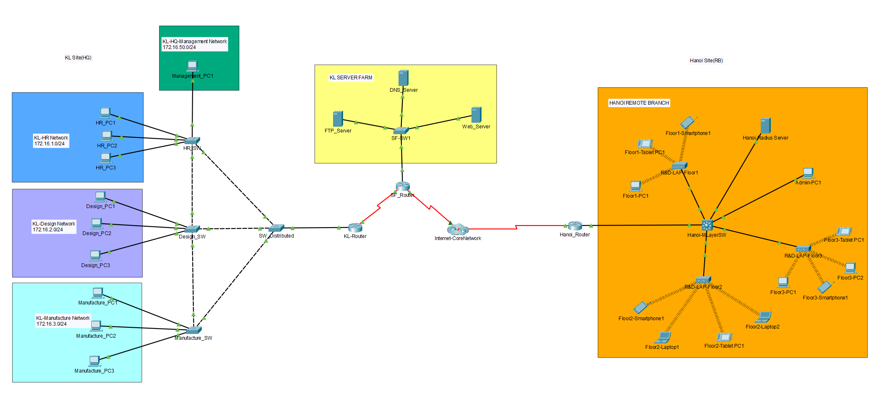{width="8.0in"
height="4.284027777777778in"}

The figure above shows the entire network layout of the High Dot Tech
Company network. There are 3 LANs present where the Hanoi is a WLAN as a
wireless architecture has been implemented.

# 

# 

# 

# 

# LAN Configurations

**KL Site LAN**

{width="5.396111111111111in"
height="6.548947944006999in"}

The HQ of High Dot Tech which is situated in KL has a total of 4
switches where 3 of the switches are designated to each department which
are HR, Design and Manufacture. There fourth switch acts as a
distribution where the access layer is connected to the core layer. Four
VLANs are created for each department and also one as the management
VLAN. The ports which are a switch-to-switch connection are configured
as trunk ports in order to carry multiple VLANSs in a single interface
whereas the switch-to-end devices connections are configured as access
ports to only access the respective VLAN. InterVLAN routing is
configured in the KL-Router to enable end devices from different
departments to communicate with each other.

{width="4.521065179352581in"
height="2.1251093613298337in"}

The end devices in the KL site are using the DHCP server pool created in
the router to gain the IP address. DHPC is configured in the KL site to
ease configurations and also improve the scalability of the LAN.

**VLAN Management in KL Switches**

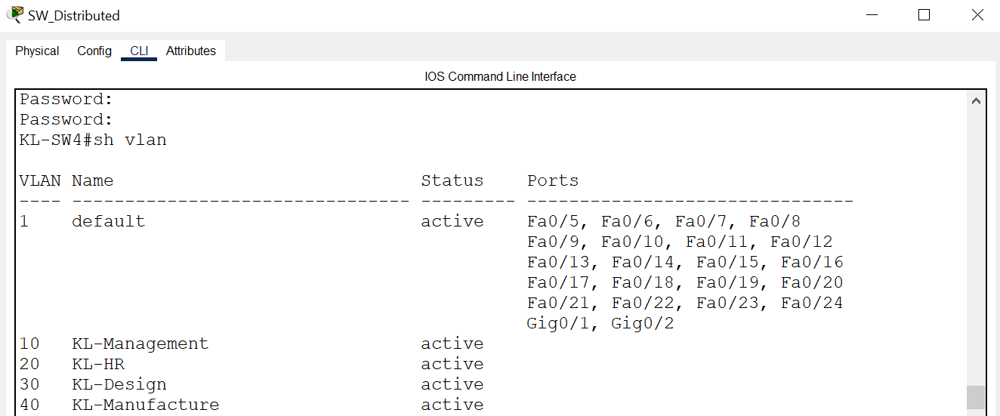{width="6.5in"
height="2.704861111111111in"}

KL-Distributed Switch

{width="6.5in"
height="2.620138888888889in"}

KL-HR SWITCH

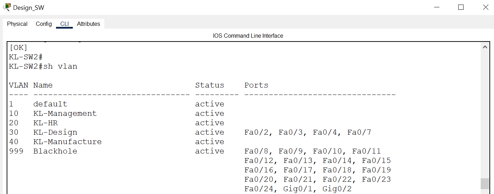{width="6.5in"
height="2.561111111111111in"}

KL-DESIGN SWITCH

{width="6.5in"
height="2.470833333333333in"}

KL-MANUFACTURE SWITCH

The screenshot below shows the DHCP pools created in the KL-Router to
facilitate the end devices of each department with the respective IP
addresses based on the VLAN of the department. The first 10 IP addresses
are excluded for each DHCP pool as those IP addresses are kept for
management devices, default gateways and broadcast addresses.

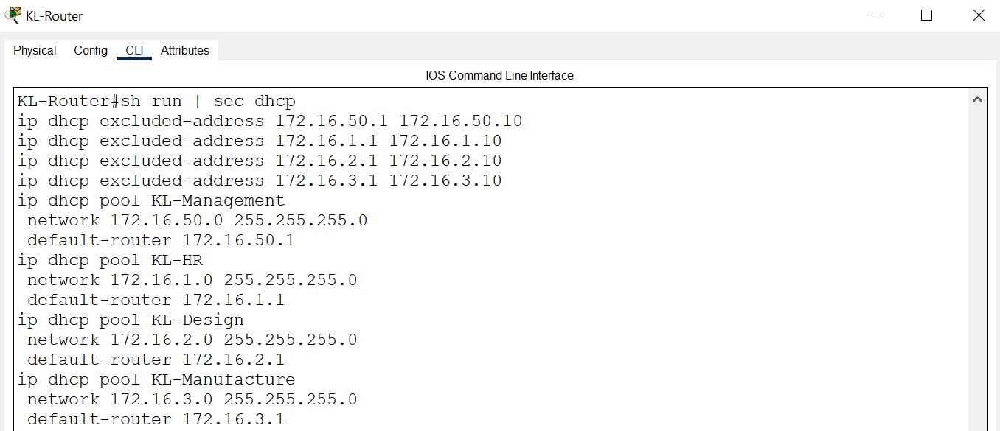{width="6.5in"
height="2.8041666666666667in"}

**InterVLAN Routing in KL Site**

{width="6.5in"
height="2.3930555555555557in"}

The router on a stick configuration method is implemented in the KL Site
in order to enable communications between multiple VLANs. Four
sub-interfaces are created in the KL-Router to enable the end devices in
each VLAN to communicate with one another. The sub-interfaces are
configured with the IP addresses of the VLAN default gateways based on
each department.

**KL SERVER FARM LAN**

{width="3.8543646106736658in"
height="2.5140179352580927in"}

The KL Server Farm consists of three servers which are the DNS , web and
FTP server. This server are grouped into one VLAN which has the VLAN ID
of 50 and is named KL-ServerFarm. There is a centralized switch which
acts as a access layer and also distributor layer switch. The
switch-to-server connections are configured as access points to VLAN 50
whereas the switch-to-router connection is configured as a trunk port.

SERVER CONFIGURATION

The servers in KL Server Farm are configured statically to allow the
management to customize the Ips of the servers manually.

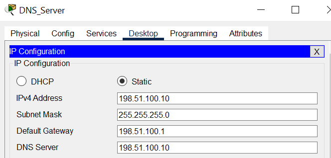{width="4.611111111111111in"
height="2.2083333333333335in"}

KL-DNS SERVER

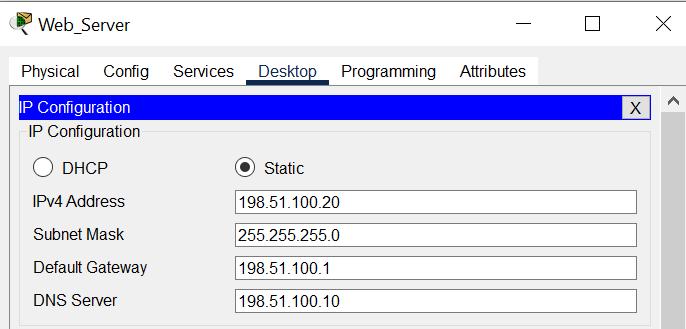{width="4.763888888888889in"
height="2.2847222222222223in"}

KL-WEB SERVER

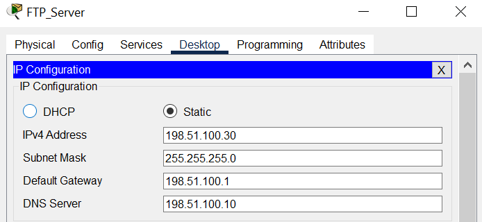{width="4.819444444444445in"
height="2.2222222222222223in"}

KL-FTP SERVER

**VLAN MANAGEMENT IN KL SERVER FARM SWITCH**

{width="6.5in"
height="2.2618055555555556in"}

**TRUNKING CONFIGURATION IN KL SERVER FARM SWITCH**

{width="6.5in"
height="2.5965277777777778in"}

The interface which connects to the router is configured as a trunk port
with the 801.1q encapsulation mode.

**INTERVLAN ROUTING IN KL SERVER FARM ROUTER**

{width="6.5in"
height="1.1208333333333333in"}

**HANOI REMOTE BRANCH LAN**

{width="5.708333333333333in"
height="5.138888888888889in"}

The Hanoi remote branch has a distributed switch in the center which
connects the access layers to the core layer. Three access points are
configured in the Hanoi LAN to facilitate a wireless architecture in the
remote branch to ease the wireless communication and connections. Three
VLANs are created in this LAN which are the management VLAN which is the
native VLAN with the VLAN ID of 100, the R&D VLAN with the VLAN ID of 10
and also the Blackhole VLAN for unused ports. The DHCP server is
configured in the Hanoi-Router which enables DHCP for the end devices in
the network to obtain their IP addresses dynamically. This is done to
improve the scalability of the network. The end devices in R&D Floor 1,2
and 3 access the VLAN 10 which is the R&D VLAN for communications
whereas the Radius server and the admin PC is accessing the management
VLAN. The radius server is configured with authorized usernames and
password to authenticate the remote connection to network devices.

**VLAN MANAGEMENT IN HANOI SITE**

{width="6.5in"
height="1.9715277777777778in"}

**TRUNKING CONFIGURATION IN HANOI SWITCH**

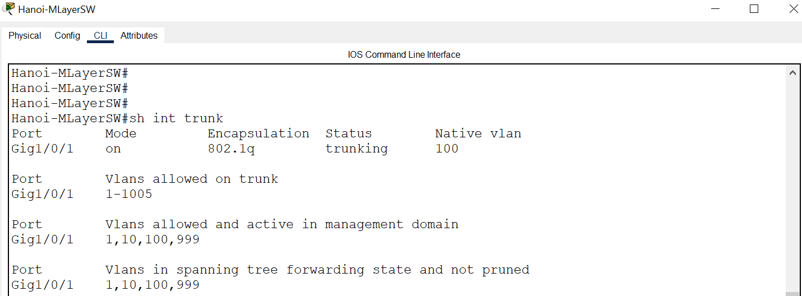{width="6.5in"
height="1.851388888888889in"}

**INTERVLAN ROUTING IN HANOI ROUTER**

{width="6.5in"
height="2.6618055555555555in"}

2 sub-interfaces are configured in the Hanoi-Router for the management
VLAN and also the R&D VLAN. Both interfaces are configured with the IP
address of the default-gateway of both VLANs to enable connections with
multiple VLANs.

**RADIUS SERVER CONFIGURATION**

The radius server is configured with a AAA service where multiple
authorized user credentials are stored for accessing the networking
devices in the Hanoi LAN via SSH.

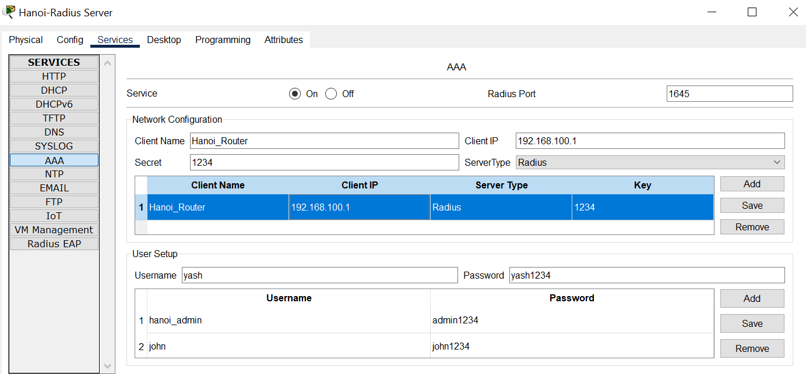{width="6.5in"
height="3.022222222222222in"}

# 

# 

# 

# WAN Configurations

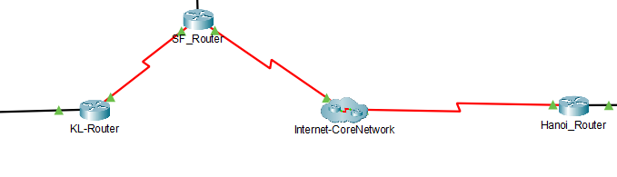{width="5.402777777777778in"
height="1.6111111111111112in"}

The WAN of this network consists of 3 routers and also a core ISP
network which is a cluster of two ISP routers. The serial ports of the
routers are configured with IP addresses in order to communicate with
each other. The serial DCE ports are configured with the clock rate of
64000 to ensure a stable and fast connection to route packets.

**ROUTING PROTOCOL**

The Open Shortest Path First (OSPF) dynamic routing protocol has been
implemented for High Dot Tech Company. OSPF is derived from the Interior
Gateway Protocol (IGP) which search for the most efficient and quick
routing path between the source and destination router using the SPF
algorithm. OSPF allows the routers in the network to share information
regarding data and packets dynamically and stores the information in the
routing table automatically. The SPF algorithm eliminates loops in the
network topology. OSPF has been chosen as it does not have a limit to
the hop count as the RIP routing protocol and also provides better load
balancing than other routing protocol. OSPF is also adaptive to scalable
networks which is suitable for High Dot Tech as they are constantly
making changes to scale and improve their network.

**OSPF CONFIGURATIONS IN ROUTERS**

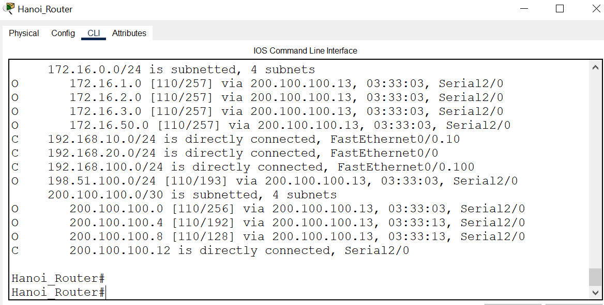{width="6.5in"
height="3.5625in"}

Hanoi_Router

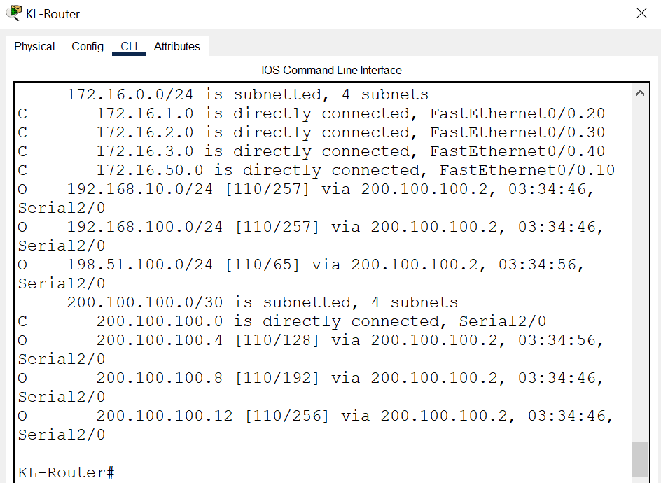{width="6.472222222222222in"
height="4.383333333333334in"}

KL-Router

{width="6.5in"
height="5.170833333333333in"}

KL Server Farm-Router

{width="6.5in"
height="5.058333333333334in"}

ISP1-Router

{width="6.5in"
height="5.3625in"}

ISP2-Router

# Layer 2 Security Configurations

**Port Security Implementation**

Port Security is configured to mitigate layer 2 attacks such as Denial
of Service by limiting the number of devices to connect to certain
ports. The networking devices in the KL site, KL server farm and Hanoi
remote branch are configured with port security to secure the ports from
unauthorized access.

Port Security Configuration

{width="6.5in"
height="3.9631944444444445in"}

{width="6.5in"
height="1.211111111111111in"}

If a unknow device attempts to access with particular port and ping
another device the port will automatically shutdown and disallow any
pings to take place. The screenshot below shows the led light of the
port turning red when the violation mode is triggered.

{width="2.729306649168854in"
height="1.8125929571303587in"}

**SSH Implementation**

SSH is enabled as a countermeasure to possible Man In The Middle and IP
spoofing attacks. SSH is a more secure protocol than telnet as it uses
encryption in the data transmission and also the remote connection. In
the KL Site ssh is enabled with a local username and password whereas in
the Hanoi Remote Branch the ssh is enabled with the username and
password in a radius server which authenticates the user to access the
network devices remotely.

SSH Configuration in Kl Site

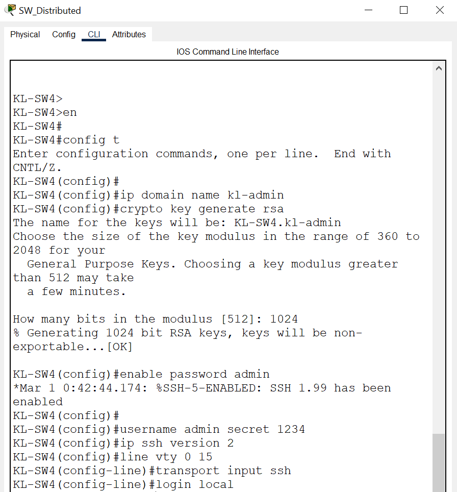{width="6.222222222222222in"
height="6.694444444444445in"}

End device remote connection to the Switch

{width="4.868305993000875in"
height="2.243170384951881in"}

Remote connection of Switch established

{width="4.784968285214348in"
height="3.1459951881014874in"}

Disabling unused Ports and creating Blackhole vlan

Unused ports are disabled by giving the shutdown command . The blackhole
vlan is created and all the unused ports are grouped into the blackhole
vlan to reduce the vulnerability of the networking devices.

{width="3.3404494750656166in"
height="0.576418416447944in"}

{width="6.5in"
height="3.61875in"}

{width="6.5in"
height="0.8215277777777777in"}

# Conclusion

The network configurations of the High Dot Tech company networking site
have been presented with relevant justification and screenshots. The
communications between the devices from different VLANs and LANs are
shown to be successful and the implementation of the new VLAN
configuration and WLAN configuration in Hanoi has been successful. The
scalability of the network has been improved with several configurations
such as DHCP and OSPF routing protocol. Multiple security protocols have
been implemented to keep the network secured such as port security and
SSH implementation for remote access. I would like to thank my lecturer
, Mr. .Joshua Samual to educate me with the relevant content which has
helped me to complete the network configurations and complete this
assignment. The ping results are shown in the appendices section below.

# Appendices

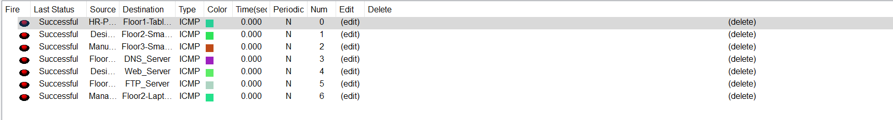{width="7.951388888888889in"
height="1.4375in"}

The figure above shows that all the communications between end devices
from different departments are successful. The Kl HQ is able to
communicate and send packets to the Hanoi Remote Branch and all the
servers are able to provide the services to both KL Site and Hanoi Site.

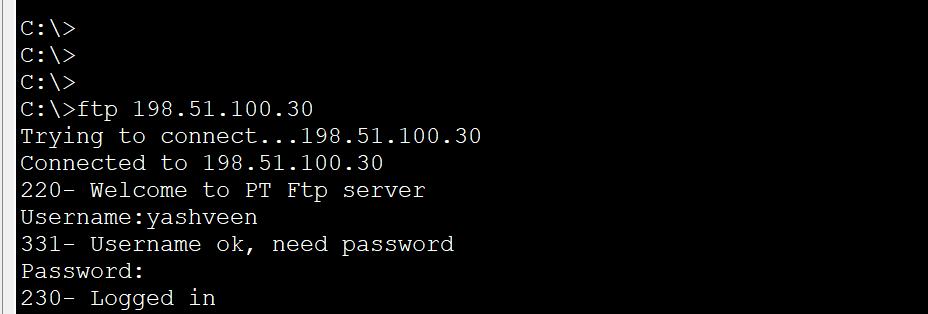{width="6.444775809273841in"
height="2.180667104111986in"}

The figure above shows that the end devices are able to connect to the
ftp server.

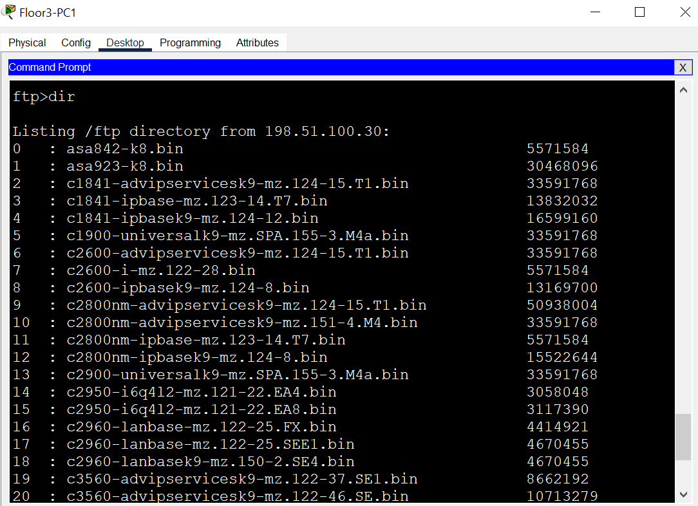{width="6.5in"
height="4.7131944444444445in"}

The dir command lists all the available files in the FTP server.

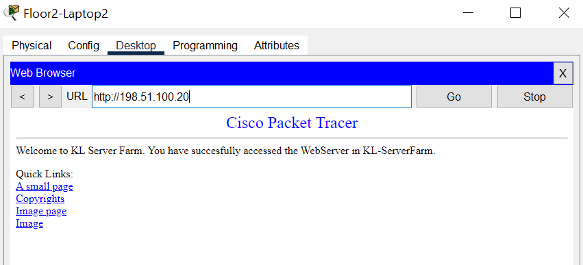{width="5.909722222222222in"
height="2.6875in"}

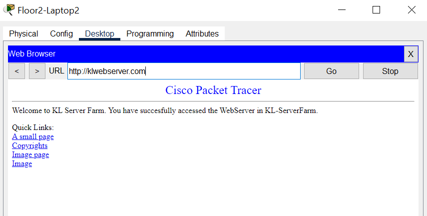{width="5.9375in"
height="3.0in"}

The webserver is accessible with both the IP address and also the domain
name which is klwebserver.com which is set in the DNS server.
